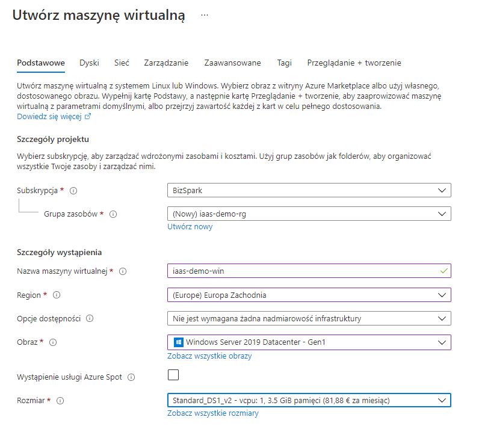
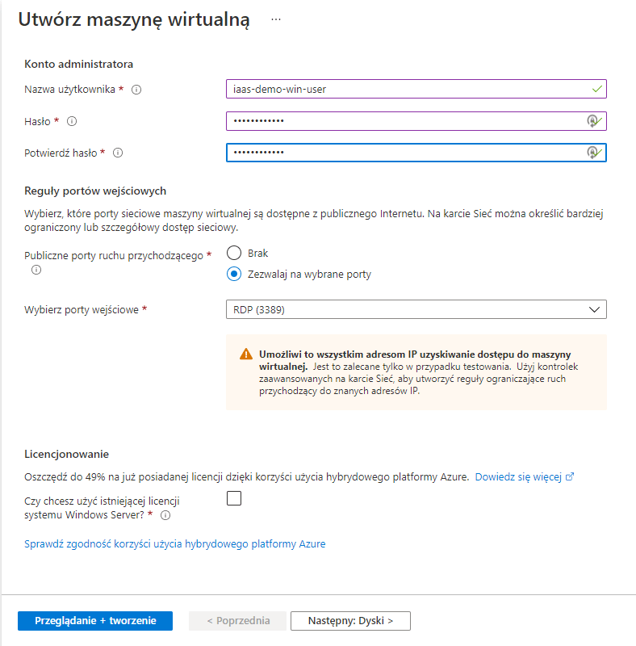
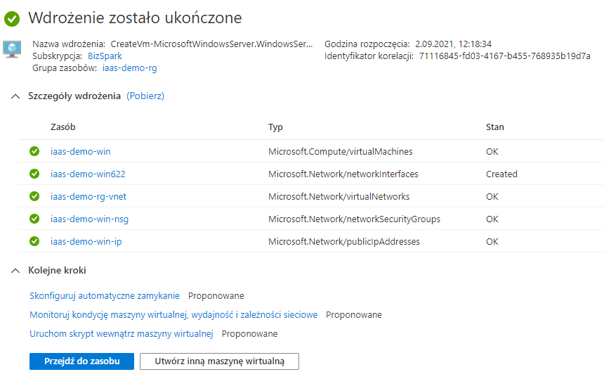
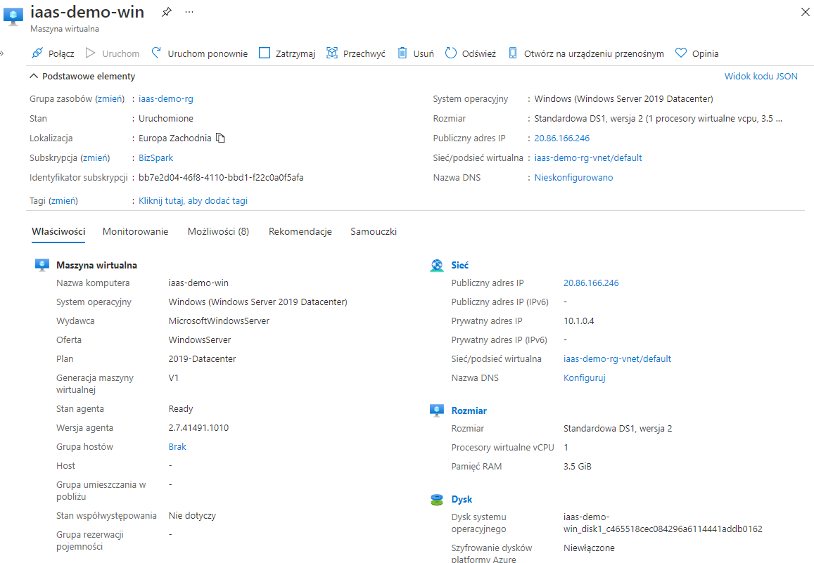
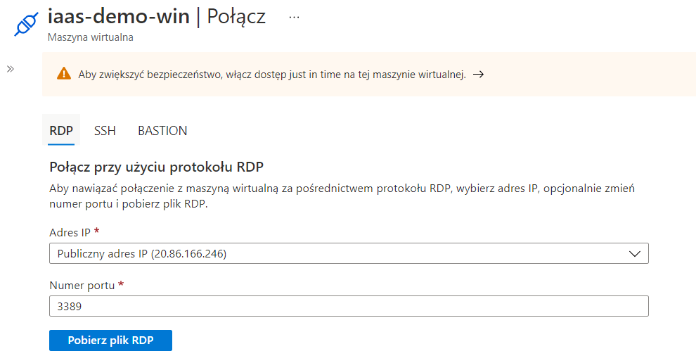

# I. Implementacja rozwiązań Infrastructure as a service część 1 - Maszyny wirtualne

**Implementacja rozwiązań IaaS** jest częścią tematu **Develop Azure compute solutions** egzaminu **AZ-204**.

Umiejętności badane w tej części egzaminu:
* **Uruchamianie maszyn wirtualnych (VM)**
* Konfiguracja, walidacja i wdrażanie **szablonów ARM**
* Konfiguracja obrazów kontenerów 
* Publikacja obrazów w **Azure Container Registry**
* Uruchamianie kontenerów za pomocą **Azure Container Instance**

## 1. Uruchamianie maszyn wirtualnych
Zacznijmy od ogólnego przeglądu tego, z czego składa się maszyna wirtualna.
Maszyny wirtualne platformy Azure (**VMs**) są wdrażane w **grupach zasobów** i znajdują się w **regionach** platformy Azure. Zwykle chcemy umieścić maszynę wirtualną w **regionie** blisko aplikacji lub użytkowników, którzy będą korzystać z usług wdrożonych na tej maszynie wirtualnej.
Podczas budowania maszyny wirtualnej wybieramy spośród wstępnie skonfigurowanych **rozmiarów maszyn wirtualnych** na podstawie liczby rdzeni procesora, ilości pamięci RAM, a także różnych możliwości wydajności dysku. Wybrany rozmiar zależy od obciążenia wdrażanego na tej maszynie wirtualnej. Rozmiar maszyny wirtualnej można łatwo zaktualizować lub obniżyć po wdrożeniu maszyny wirtualnej. 
Kolejnym kluczowym elementem wdrażania maszyny wirtualnej jest **połączenie sieciowe** maszyny wirtualnej z resztą środowiska i w razie potrzeby z Internetem. Kolejnym składnikiem maszyny wirtualnej są **obrazy maszyn wirtualnych**. Obrazy są podstawowym obrazem używanym do wdrażania na naszej maszynie wirtualnej, najczęściej systemów operacyjnych, takich jak Windows lub Linux. W portalu *Azure Marketplace* dostępnych jest wiele różnych obrazów maszyn wirtualnych opartych na wielu różnych systemach operacyjnych z róznymi edycjami, obrazy ze wstępnie skonfigurowanymi aplikacjami oraz sieciowe urządzenia wirtualne. 
Ostatnim składnikiem maszyny wirtualnej jest **pamięć masowa**. Każda utworzona maszyna wirtualna będzie miała co najmniej jeden dysk wirtualny do obsługi podstawowego systemu operacyjnego. W razie potrzeby można dodać dodatkowe dyski wirtualne w celu obsługi danych aplikacji. 

#### Metody tworzenia maszyn wirtualnych na platformie Azure:
Podczas tworzenia maszyny wirtualnej na platformie Azure mamy do dyspozycji kilka narzędzi:
* **Azure Portal** 
* **Azure CLI** 
* **Azure PowerShell (Az Module)**
* **Azure ARM Templates**

### 2 Tworzenie maszyny wirtualnej w portalu Azure
Aby utworzyć **maszynę wirtualną** w portalu Azure należy przejść do usługi **Maszyny Wirtualne** i wcisnąć guzik **utwórz maszynę wirtualną**.
Na stronie tworzenie maszyny wirtualnej pierwsza sekcja to informacje **Podstawowe** o tworzonej maszynie. Na górze strony można zobaczyć, że istnieją dodatkowe sekcje dotyczące dysków, sieci, zarządzania itp. Te sekcje umożliwiają tworzenie bardziej niestandardowych konfiguracji, takich jak dodawanie dodatkowych dysków lub dodawanie maszyny wirtualnej do istniejącej sieci wirtualnej, a nawet tworzenie bardziej szczegółowych reguł zabezpieczeń sieci.



W sekcji **Podstawowe** przypisujemy tworzoną maszynę wirtualną do **subskrypcji** i do **grupy zasobów**. Jeśli **grupa zasobów** nie istnieje to można ją utworzyć. 
Następnie definiujemy szczegóły instancji, w której nadajemy maszynie wirtualnej **nazwę** i wybieramy **region**, w którym chcemy wdrożyć maszynę wirtualną. Następnie, opcjonalnie, możemy określić zestawy i strefy dostępności. Następnie wybierzemy **obraz maszyny wirtualnej** z listy obrazów dostępnych w wybranym regionie.

Kolejna opcja to **Azure Spot**, która pozwala na użycie maszyny w obniżonej cenie lecz umożliwia platformie Azure zatrzymanie i zwolnienie maszyny wirtualnej, jeśli platforma Azure z dowolnego powodu potrzebuje z powrotem tej pojemności obliczeniowej.

Następnie definiujemy **rozmiar maszyny wirtualnej**, w przypadku tej demonstracji wybieramy najniższy z naszej listy rozmiarów maszyn wirtualnych dostępnych w regionie.



W sekcji **Konto administratora** definiujemy wymagane informacje dotyczące dostępu administracyjnego do maszyny wirtualnej. W systemie Windows jest to nazwa użytkownika i hasło, a w systemie Linux może to być nazwa użytkownika i hasło lub klucz publiczny SSH.

Na koniec definiujemy kilka **reguł portów przychodzących**, aby uzyskać dostęp do tej maszyny wirtualnej. W konfiguracji domyślnej maszyna wirtualna otrzyma publiczny adres IP w celu uzyskania dostępu do tej maszyny wirtualnej przez Internet. Ale domyślnie dostęp spoza sieci wirtualnej lub Internetu nie jest dozwolony. Dodanie tutaj reguł portów przychodzących jest sposobem na zezwolenie na dostęp sieciowy do maszyny wirtualnej poprzez określenie, które porty przychodzące chcemy otworzyć. Wybranie portu przychodzącego w tym miejscu doda regułę do grupy zabezpieczeń sieci, umożliwiając dostęp z dowolnego adresu IP na określonym porcie. Ponieważ jest to maszyna wirtualna Windows i chcemy uzyskać do niej zdalny dostęp, otworzymy protokuł RDP na porcie 3389. Pozwoli to na dostęp RDP do tej maszyny wirtualnej na tym porcie z dowolnego adresu IP. Możemy również dodać inne porty, takie jak 80 dla HTTP, 443 dla HTTPS i port 22 dla dostępu SSH do maszyny wirtualnej.

Dane do wprowadzenia w sekcji **Podstawowe**:

| Sekcja       | Wartość       |
|:----------------|:---------------|
| Subskrypcja | *{subscription_name}* |
| Grupa zasobów | *(new) iaas-demo-rg* |
| Nazwa maszyny wirtualnej | *iaas-demo-win* |
| Region | *Europa Zachodnia* |
| Opcje dostępności | *Nie jest wymagana żadna nadmiarowość infrastruktury* |
| Obraz | *Windows server 2019 Datacenter - Gen1* |
| Rozmiar | *Standard_DS1_v2* |
| Username | *iaas-demo-win-user* |
| Password | *{jakieś-hasło}* |
| Publiczne porty ruchu przychodzącego | *Zezwalaj na wybrane porty* |
| Wybierz porty wejściowe | *RDP (3389)* |
| **Przeglądanie + tworzenie** |  |

**Widok w trakcie wdrażania maszyny:**


**Widok detali utworzonej maszyny wirtualnej:**


Aby połączyć się do maszyny za pomocą protokołu RDP wybieramy guzik **Połącz** z górnego menu na stronie detali maszyny wirtualnej i pobieramy plik RDP:


### 3 Tworzenie maszyny wirtualnej w kodzie
Jako programiści jesteś przyzwyczajony do pisania kodu do tworzenia aplikacji. Na platformie Azure istnieje możliwość tworzenia maszyn wirtualnych i infrastruktury przy użyciu kodu. A wdrażanie infrastruktury, takiej jak maszyny wirtualne z kodem, zapewnia Twojej organizacji dużą wartość:
* wdrażanie maszyn wirtualnych z kodem zwiększa spójność wdrożeń i tworzenia maszyn wirtualnych, dzięki czemu można za każdym razem tworzyć wiele maszyn wirtualnych w ten sam sposób. 
* jak każdy inny kod, kod infrastruktury można umieścić w repozutorium kodu źródłowego takim jak np. GIT. 
* kod infrastruktury może być użyty do wdrażania systemów produkcyjnych z wykorzystaniem automatyzacji. 
* dzięki wdrożeniom w kodzie, możesz wykorzystać ten kod do konstruowania podobnych środowisk takich jak DEV/TEST/STG.

Niezależnie od tego, czy tworzymy maszynę wirtualną za pomocą interfejsu wiersza polecenia platformy Azure, czy programu Azure PowerShell z modułem Az, proces tworzenia maszyny wirtualnej w kodzie składa się z tych samych kroków:
1. Logowanie i ustawienie aktywnej subskrypcji
2. Tworzenie grupy zasobów (resource group)
3. Tworzenie maszyny wirtualnej (VM)
4. Udostępnienie portu dostępu zdalnego (w systemie Windows jest to port TCP 3389. W przypadku RDP i Linux jest to port TCP 22 dla SSH.)
5. Pobranie publicznego adresu IP

#### 3.1 Tworzenie maszyny wirtualnej za pomocą Azure CLI
1. Logowanie i ustawienie aktywnej subskrypcji

Za pomocą polecenia `az login` logujemy się na konto Azure. Po uruchomieniu polecenia uruchomi się przeglądarka internetowa z dialogiem logowania do konta Azure.

Za pomocą polecenia `az account set --subscription` ustawiamy aktywną subskrypcję.

```powershell
#Login and set a subscription 
az login
az account set --subscription "<SUBSCRIPTION_NAME>"
```

2. Tworzenie grupy zasobów

Możemy utworzyć grupę zasobów za pomocą polecenia Azure CLI: `az group create`. Nadajemy tej grupie zasobów nazwę, wybieramy lokalizację w której chcemy utworzyć grupę zasobów. Możemy też oczywiście wdrożyć maszynę wirtualną w już istniejącej grupie zasobów.

```powershell
az group create \
--name "iaas-demo-rg" \
--location "westeurope"
```

3. Tworzenie maszyny wirtualnej
Możemy utworzyć maszynę wirtualną za pomocą polecenia Azure CLI: `az vm create`. Jako parametry dodajemy nazwę grupy zasobów, nazwę maszyny wirtualnej, obraz systemu oraz dane uwierzytelniające służące do zalogowania się do systemu. Procedura różni się nieco dla systemów Windows i Linux.

**Windows:**

Obraz maszyny wirtualnej *Windows 2019 Server Datacenter* to *win2019datacenter*. Kolejne dwa parametry definiują nazwę użytkownika administratora i hasło administratora. Ponieważ jest to Windows, to konto będzie lokalnym kontem administratora, którego można użyć do zalogowania się do maszyny wirtualnej za pierwszym razem.
Możesz określić rozmiar maszyny wirtualnej za pomocą parametru o nazwie *size*. Jeśli nic nie zostanie wybrane to domyślnie otrzymamy maszynę wirtualną *Standard Ds1 v2*.

```powershell
az vm create \
--resource-group "iaas-demo-rg" \
--name "iaas-demo-win" \
--image "win2019datacenter" \
--admin-username "iaasdemoadmin" \
--admin-password "iaasdemoadmin123$%^"
```

**Linux:**

Jeśli chcemy utworzyć maszynę wirtualną z Linuksem, wzorzec jest bardzo podobny. Jako obraz Linuksa możemy wybrać Ubuntu LTS.
Możemy zmienić typ uwierzytelniania dla tej maszyny wirtualnej na ssh (domyślnym jest hasło).  Lokalizacja tego klucza pochodzi z pliku na dysku lokalnym.

```powershell
az vm create \
--resource-group "iaas-demo-rg" \
--name "iaas-demo-linux" \
--image "UbuntuLTS" \
--admin-username "iaasdemoadmin" \
--authentication-type "ssh" \
--ssh-key-value ~/.ssh/id_rsa.pub
```

Powyższe dwa przykłady pokaują minimalne parametry potrzebne do utworzenia maszyny wirtualnej za pomocą Azure CLI. Dostępnych jest wiele innych opcji, takich jak dołączenie maszyny wirtualnej do już istniejącej sieci wirtualnej lub sieciowej grupy zabezpieczeń.

4. Udostępnienie portu dostępu zdalnego

Polecenie otwierające port dostępu zdalnego to `az vm open-port`. Należy określić nazwę grupy zasobów, nazwę maszyny wirtualnej oraz port, który chcemy otworzyć. 
To polecenie doda regułę otwierania portu (3389 dla Windows lub 22 dla SSH w Linuxie) w sieciowej grupie zabezpieczeń, do której jest dołączona jest maszyna wirtualna. 

**Windows:**
```powershell
az vm open-port \
--resource-group "iaas-demo-rg" \
--name "iaas-demo-win" \
--port "3389"
```

**Linux:**
```powershell
az vm open-port \
--resource-group "iaas-demo-rg" \
--name "iaas-demo-linux" \
--port "22"
```

5. Pobranie publicznego adresu IP
Aby pobrać publiczny adres IP za pomocą Azure CLI używamy polecenia `az vm list-ip-addresses`. Za pomocą tego polecenia określasz nazwę grupy zasobów i nazwę maszyny wirtualnej. Spowoduje to wyświetlenie publicznego adresu IP powiązanego z określoną maszyną wirtualną.

```powershell
az vm list-ip-addresses \
--resource-group "iaas-demo-rg" \
--name "iaas-demo-win"
```

#### Kod demo:
[create-win-vm-by-azure-cli](https://github.com/michalsimon/Exam-AZ-204/blob/main/src/IaaS/create-win-vm-by-azure-cli.ps1)

[create-linux-vm-by-azure-cli](https://github.com/michalsimon/Exam-AZ-204/blob/main/src/IaaS/create-linux-vm-by-azure-cli.ps1)

#### 3.2 Tworzenie maszyny wirtualnej za pomocą Azure Power Shell
Logicznie proces tworzenia maszyny wirtualnej jest taki sam jak dla Azure CLI.

1. Logowanie i ustawienie aktywnej subskrypcji:

Za pomocą polecenia `Connect-AzAccount` logujemy się na konto Azure. Po uruchomieniu polecenia uruchomi się przeglądarka internetowa z dialogiem logowania do konta Azure.

Za pomocą polecenia `Set-AzContext -SubscriptionName` ustawiamy aktywną subskrypcję.

```powershell
#Login and set a subscription
Connect-AzAccount -SubscriptionName 'BizSpark'
Set-AzContext -SubscriptionName 'BizSpark'
```

2. Tworzenie grupy zasobów

Grupę zasobów tworzymy za pomocą polecenia: `New-AzResourceGroup`. Nadajemy tej grupie zasobów nazwę i wybieramy lokalizację.

```powershell
#Create a Resource Group
New-AzResourceGroup -Name "iaas-demo-rg" -Location "WestEurope"
```

3. Tworzenie maszyny wirtualnej i udostępnienie portu dostępu zdalnego

Krokiem wymaganym do utworzenia maszyny wirtualnej w programie PowerShell jest utworzenie obiektu *PSCredential*, który będzie zawierał nazwę użytkownika i hasło używane do poświadczeń konta administratora lokalnego na wdrażanej maszynie wirtualnej. Obiekt *PSCredential* definiujemy z nazwą użytkownika i hasłem skonwertowanym na bezpieczny ciąg jako parametrami wejściowymi. Aby skonwertować hasło na bezpieczny ciąg używamy polecenia `ConvertTo-SecureString`.

Polecenie *New-AzVM* tworzy maszynę wirtualną na platformie Azure. Jako parametry definiujemy nazwę grupy zasobów, nazwę maszyny wirtualnej i Credential.
W ramach procesu tworzenia maszyny wirtualnej, za pomocą parametru *OpenPorts*, możemy określić porty które mają być otwarte na maszynie wirtualnej.

```powershell
#Create a VM credentials
$username = 'iaasdemoadmin'
$password = ConvertTo-SecureString 'iaasdemoadmin123$%^' -AsPlainText -Force
$WindowsCred = New-Object System.Management.Automation.PSCredential ($username, $password)

#Create a Windows VM
New-AzVM `
    -ResourceGroupName 'iaas-demo-rg' `
    -Name 'iaas-demo-win' `
    -Image 'Win2019Datacenter' `
    -Credential $WindowsCred `
    -OpenPorts 3389
```

5. Pobranie publicznego adresu IP

Aby pobrać publiczny adres IP można użyć polecenia `Get‑AzPublicIpAddress`, a następnie określić nazwę grupy zasobów i nazwę maszyny wirtualnej i użyć `Select-Object`, aby zwrócić tylko pole `IpAddress` ze zwróconego obiektu.

```powershell
#Get the Public IP 
Get-AzPublicIpAddress `
    -ResourceGroupName 'iaas-demo-rg' `
    -Name 'iaas-demo-win' | Select-Object IpAddress
```

#### Kod demo:
[create-win-vm-by-azure-powershell](https://github.com/michalsimon/Exam-AZ-204/blob/main/src/IaaS/create-win-vm-by-azure-powershell.ps1)