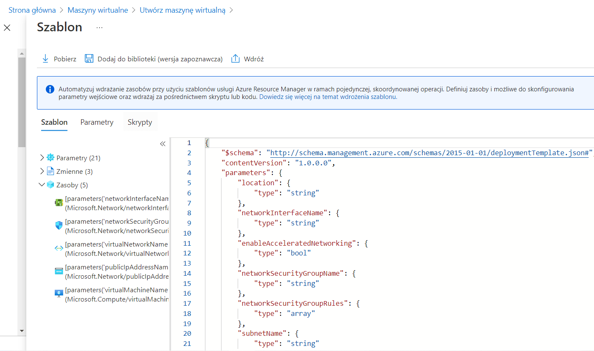

# II. Implementacja rozwiązań Infrastructure as a service część 2 - ARM templates

**Implementacja rozwiązań IaaS** jest częścią tematu **Develop Azure compute solutions** egzaminu **AZ-204**.

Umiejętności badane w tej części egzaminu:
* Uruchamianie maszyn wirtualnych (**VM**)
* **Konfiguracja, walidacja i wdrażanie **szablonów ARM****
* Konfiguracja obrazów kontenerów 
* Publikacja obrazów w **Azure Container Registry**
* Uruchamianie kontenerów za pomocą **Azure Container Instance**

## 1. Szablony ARM
**Szablon ARM** to plik w formacie *JSON*, który jest dokumentem konfiguracyjnym definiującym zasoby, które mają zostać wdrożone na *platformie Azure* wraz z ich konfiguracjami. Za pomocą **szablonu ARM** można utworzyć dowolny zasób.
**Szablony ARM** są podstawowym elementem automatyzacji wdrażania infrastruktury *Azure*.

Korzystając z **szablonów ARM**, można sparametryzować elementy konfiguracji dla zasobów zdefiniowanych w szablonie. Można użyć parametrów dla często zmienianych elementów konfiguracji, takich jak nazwy maszyn wirtualnych, nazwy sieci wirtualnych itd. Można następnie użyć tego samego **szablonu ARM** wielokrotnie używając różnych parametrów, aby wdrożyć różne środowiska np. inny zestaw parametrów dla produkcji i inny dla QA.

**Szablon ARM** można skompilować i wyeksportować z *portalu Azure* lub napisać ręcznie. Ponadto można zacząć od kolekcji szablonów szybkiego startu dostępnych w *Azure Portal* w bloku wdrażania niestandardowego.

## 2. Wdrażanie szablonów ARM:
Po utworzeniu **szablonu ARM** przesyłamy go do usługi **Azure Resource Manager**. **Resource Manager** odbiera szablon w postaci pliku *JSON*, a następnie konwertuje go na operacje interfejsu *REST API*.
W celu wdrożenia możemy użyć różnych narzędzi a w tym: 
* **Azure Portal**
* **Azure CLI**
* **PowerShell (Az Module)**
* **REST API**
* **Azure Cloud Shell**

## 3. Format szablonu ARM

W swojej najprostszej strukturze szablon składa się z następujących elementów:

```powershell
{
"$schema": "https://schema.management.azure.com/schemas/2019-04-01/.
deploymentTemplate.json#",
"contentVersion": "",
"apiProfile": "",
"parameters": { },
"variables": { },
"functions": [ ],
"resources": [ ],
"outputs": { }
}
```

* **$schema** - Lokalizacja schematu JSON opisującego wersję języka szablonu.
* **contentVersion** - Wersja szablonu (np. 1.0.0.0). Można użyć dowolną wartość, aby udokumentować znaczące zmiany w szablonie.
* **apiProfile** - Wersja interfejsu API, która służy jako kolekcja wersji interfejsu API dla typów zasobów. Użyj tej wartości, aby uniknąć konieczności określania wersji interfejsu API dla każdego zasobu w szablonie. 
* **parameters** - Wartości parametrów podawane podczas wdrażania w celu dostosowania zasobów.
* **variables** - Wartości używane jako fragmenty JSON w szablonie w celu uproszczenia wyrażeń języka szablonu.
* **functions** - Funkcje zdefiniowane przez użytkownika, które są dostępne w szablonie.
* **resources** - Typy zasobów, które są wdrażane lub aktualizowane w grupie zasobów lub subskrypcji.
* **outputs** - Wartości zwracane po wdrożeniu.

Więcej na temat struktury i składni mozna przeczytać na stronie: [Struktura i składnia szablonu ARM](https://docs.microsoft.com/en-us/azure/azure-resource-manager/templates/syntax)

## 4. Demo - Pobranie szablonu ARM maszyny wirtualnej z portalu Azure:
Aby utworzyć **szablon ARM**, zamiast tworzyć go od początku ręcznie, możemy go utworzyć w **Azure Portal**. Następnie możemy go pobrać, dodać do biblioteki lub wdrożyć.

Aby utworzyć **szablon ARM**, zaczynamy od utworzenia maszyny wirtualnej w **Azure Portal**, ale zamiast tworzyć maszynę wirtualną, eksportujemy **szablon ARM** dla tego wdrożenia (proces ten jest podobny dla większości zasobów na platformie *Azure*).
Proces tworzenia maszyny wirtualnej w **Azure Portal** był opisany w poprzednim wpisie z tej serii (*I. Implementacja rozwiązań Infrastructure as a service część 1 - Maszyny wirtualne*). Po kliknięciu guzika **Przeglądanie + tworzenie**, zamiast kliknąć guzik **Utwórz** wybieramy **Pobierz szablon do automatyzacji**. Spowoduje to utworzenie plików JSON szablonu i parametrów potrzebnych do wdrożenia opartego na szablonie ARM dla właśnie skonfigurowanej maszyny wirtualnej.

Na tym ekranie w górnym menu możemy kliknąć **Pobierz**, aby pobrać pliki szablonów i parametrów, możemy kliknąć **Dodaj do biblioteki**, aby dodać je do biblioteki w celu dalszych wdrożeń, lub możemy je wdrożyć bezpośrednio z tego miejsca za pomocą guzika **Wdróż**. Dodatkowo możemy zbadać utworzone pliki w oknie poniżej:



**Pliki wygenerowanego szablonu dostępne są tutaj:**

[parameters.json](https://github.com/michalsimon/Exam-AZ-204/blob/main/src/IaaS/vm-template/parameters.json)

[template.json](https://github.com/michalsimon/Exam-AZ-204/blob/main/src/IaaS/vm-template/template.json)


**Schema:**
```json
"$schema": "http://schema.management.azure.com/schemas/2015-01-01/deploymentTemplate.json#"
```

**ContentVersion:**
```json
"contentVersion": "1.0.0.0",
```


**Parameters:**
```json
"parameters": {
        "location": {
            "type": "string"
        },
        "networkInterfaceName": {
            "type": "string"
        },
        "networkSecurityGroupName": {
            "type": "string"
        }
        #...
    }
```

**Variables:**
```json
"variables": {
        "nsgId": "[resourceId(resourceGroup().name, 'Microsoft.Network/networkSecurityGroups', parameters('networkSecurityGroupName'))]",
        "vnetId": "[resourceId(resourceGroup().name,'Microsoft.Network/virtualNetworks', parameters('virtualNetworkName'))]",
        "subnetRef": "[concat(variables('vnetId'), '/subnets/', parameters('subnetName'))]"
    }
```

**Resources:**
```json
"resources": [
        {
            "name": "[parameters('networkInterfaceName')]",
            "type": "Microsoft.Network/networkInterfaces",
            #...
        },
        {
            "name": "[parameters('networkSecurityGroupName')]",
            "type": "Microsoft.Network/networkSecurityGroups",
            #...
        },
        {
            "name": "[parameters('virtualNetworkName')]",
            "type": "Microsoft.Network/virtualNetworks",
            #...
        },
        {
            "name": "[parameters('publicIpAddressName')]",
            "type": "Microsoft.Network/publicIpAddresses",
            #...
        },
        {
            "name": "[parameters('virtualMachineName')]",
            "type": "Microsoft.Compute/virtualMachines",
            "apiVersion": "2020-06-01",
            "location": "[parameters('location')]",
            "dependsOn": [
                "[concat('Microsoft.Network/networkInterfaces/', parameters('networkInterfaceName'))]"
            ],
            "properties": {
                #...
            }
        }
    ]
```

**Outputs:**
```json
"outputs": {
        "adminUsername": {
            "type": "string",
            "value": "[parameters('adminUsername')]"
        }
    }
```


## 5. Demo - wdrożenie szablonu ARM maszyny wirtualnej:
Plik ze skryptem wdrożenia dostępny jest tutaj: [template.json](https://github.com/michalsimon/Exam-AZ-204/blob/main/src/IaaS/deploy-win-vm-arm-template-by-azure-powershell.ps1)

Przed wdrożeniem należy ustawić parametr **adminPassword** w pliku **parameters.json**.
```powershell
#Login and set a subscription
Connect-AzAccount -SubscriptionName 'BizSpark'
Set-AzContext -SubscriptionName 'BizSpark'


#Create a Resource Group
New-AzResourceGroup -Name "iaas-demo-rg" -Location "WestEurope"


#Deploy ARM Template
New-AzResourceGroupDeployment `
    -Name mydeployment -ResourceGroupName 'iaas-demo-rg' `
    -TemplateFile './vm-template/template.json' `
    -TemplateParameterFile './vm-template/parameters.json'
```